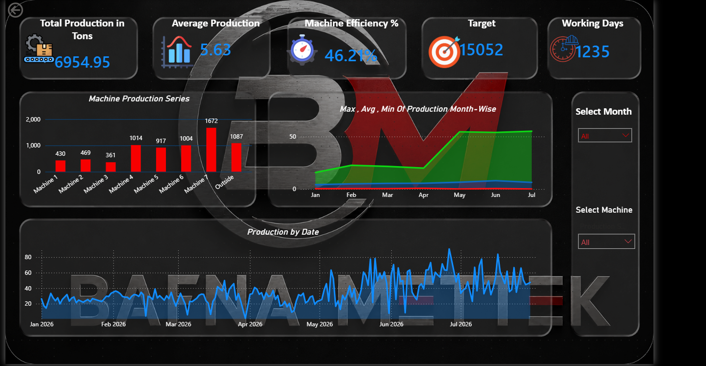

# Machine-level production analysis — Power BI

Machine-wise production tracking across 7 coil slitting machines plus outside
job work: output, target achievement, efficiency and working-day utilisation,
reviewed monthly by plant and management.

Kaushik Rodpalkar · [LinkedIn](https://www.linkedin.com/in/kaushik-rodpalkar-2297042b5) · rodpalkarkaushik@gmail.com

---

## What the analysis answers

Before this existed, production was summarised by hand each month as a single
plant total. That number could say whether the month was good, but not which
machine carried it, which one sat idle, or whether the shortfall was capacity or
utilisation.

This breaks the plant total down to the machine, and holds each machine against
the target it actually committed to.

## Measures

| Measure | Definition |
|---|---|
| Total production | Tons slit in the period, in-house and outside job work |
| Target | Committed daily target per machine × working days |
| Machine efficiency % | Actual production against target |
| Machine-days | Machines × working days — the denominator for the per-machine daily rate |
| Average production | Tons per machine per working day |

Machines carry different committed targets, so a machine cannot be judged on
tonnage alone — a low-tonnage machine running at its target is performing, and a
high-tonnage machine below target is not. Every comparison here is against the
machine's own target rather than against the other machines.

## Views

**Machine production series** — output per machine and outside job work side by
side, which makes load distribution across the line visible at a glance and
shows how much volume leaves the plant.

**Month-wise maximum, average and minimum** — the spread within each month
rather than the total alone, so a month carried by a few large coils reads
differently from a consistent one.

**Production by date** — daily output across the period, where gaps and spikes
point back to specific days for the plant to explain.

The month and machine slicers filter every visual, so the same page answers both
"how is the plant doing this month" and "how is Machine 7 doing across the
year". Filtering to one machine rebases the machine-day and average measures to
that machine, so the per-day rate stays correct at any level.

## Data

Built on the plant's daily slitting register — the same source used for
dispatch and job-work reconciliation. Machine numbers, dates, input and output
weights per coil.

## Where this led

Machine-level tracking answered how much each machine produced, but not why
material was being lost. That question needed coil-size and material-level
detail, which the register could not support without cleaning first.

That became a separate piece of work in Python, and its finding was that the
apparent scrap difference between machines is largely the width mix each machine
runs rather than the machines themselves:
[production-analytics-dashboard](https://github.com/Kaushik-Rodpalkar12/production-analytics-dashboard).

## Stack

Power BI Desktop (measures, slicers, cross-filtering), Excel as the data source.
